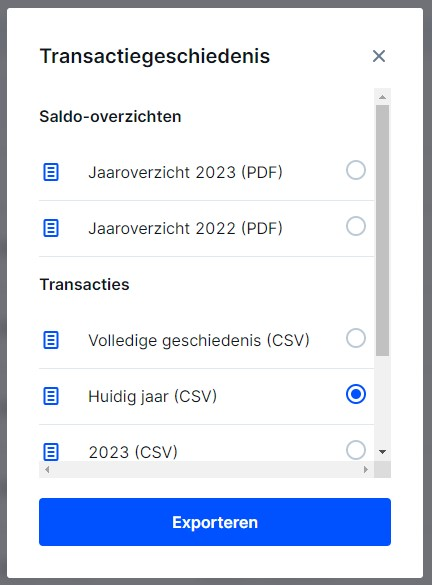
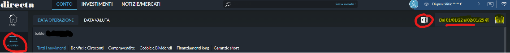

# Export to Ghostfolio

[](https://github.com/sponsors/dickwolff) &nbsp;
[](https://www.buymeacoffee.com/dickw0lff)

[](https://hub.docker.com/r/dickwolff/export-to-ghostfolio) &nbsp;  &nbsp; 

This tool allows you to convert CSV transaction exports to an import file that can be read by [Ghostfolio](https://github.com/ghostfolio/ghostfolio/). Currently there is support for 21 brokers:

- [Avanza](https://avanza.se)
- [Bitvavo](https://bitvavo.com)
- [BUX](https://bux.com)
- [Coinbase](https://coinbase.com)
- [CoinTracking.info](https://cointracking.info)
- [DEGIRO](https://degiro.com)
- [Delta](https://delta.app)
- [Directa](https://directatrading.com)
- [eToro](https://www.etoro.com/)
- [Finpension](https://finpension.ch)
- [Freetrade](https://freetrade.io)
- [Interactive Brokers (IBKR)](https://www.interactivebrokers.com)
- [Investimental](https://www.investimental.ro/)
- [Parqet](https://www.parqet.com/)
- [Rabobank](https://rabobank.nl)
- [Revolut](https://revolut.com)
- [Saxo](https://www.home.saxo)
- [Schwab](https://www.schwab.com)
- [Swissquote](https://en.swissquote.com/)
- [TradeRepublic](https://traderepublic.com)
- [Trading 212](https://trading212.com)
- [XTB](https://www.xtb.com/int)

Is your broker not in the list? Feel free to create an [issue](https://github.com/dickwolff/Export-To-Ghostfolio/issues/new) or, even better, build it yourself and create a [pull request](https://github.com/dickwolff/Export-To-Ghostfolio/compare)! For more info, see [contributing](#contributing).

## Download transaction export

See the transaction export instructions for each of the supported brokers below.

<details>
<summary>View transaction export instructions</summary>

### Avanza

Login to your Avanza account and click "Min ekonomi". Select the ["Transaktioner tab"](https://www.avanza.se/min-ekonomi/transaktioner.html), then select the desired export timeframe. Finally, click "Exportera transaktioner" to download the CSV file.

### Bitvavo

Login to your Bitvavo account and click on your name at the top-right. Next, click "Transaction history". Click the blue "Export" button at the to to create an export. Select one of the CSV options and again click "Export".



### BUX

Open the app and go to "Account Value", and then "View History". Click the download icon in the top right corner to download your transaction history. The export will be sent to your email address.

_Due to limitations by BUX, you can request up to 3 CSV exports per day!_.

### Coinbase

Go to Coinbase.com. Click on your account in the top-right, then click your name to go to your profile. Choose "Account statements" in the left menu (second to last from the bottom). Select a pre-generated transaction export (choose "CSV"), or create a custom CSV export.

### CoinTracking.info

Login to your CoinTracking.info account. Go to the "Transactions" section in the menu. Click the "Export"-button, then choose "CSV (Full Export)" **(this is important!)** to download the transactions.

### DEGIRO

Login to your DEGIRO account and create an export file (via Inbox > Account Overview, see image below). Choose the period from which you wish to export your history and click download.


### Delta

Open the Delta app. Open the menu, then click "Settings". Go to "Devices & Data", then "Export data". Select the portfolio to export, then click the "Download" button to get the CSV file.

### Directa

Open Directa App, select "Libera" mode and go on Transactions ("Movimenti").


Choose date range on the right and click on "Excel" icon, in the modal select "File separato da virgole (csv)" and "Estrai"


### eToro

Login to your eToro account and navigate to "Portfolio". Then select "History" in the top menu. Next, click on the icon on the far right and select "Account statement". Choose the dates of interest and click "Create". On the next page, click on the Excel icon on the top right to download the file. After downloading, open the file in Excel and delete all the tabs except the "Account Activity" tab. Then use Excel to convert the file to CSV (**set the separation character to comma (`,`)**).

### Finpension

Login to your Finpension account. Select your portfolio from the landing page. Then to the right of the screen select “Transactions”, on the following page to the right notice “transaction report (CSV-file)” and click to email or click to download locally.

### Freetrade

Open the Freetrade app. Select your portfolio from the option in the top-left under the "Portfolio" heading. Select "Activity" from the list of icons along the bottom of the screen. Select the share icon in the top-right corner and then follow the on-screen instructions.

### Interactive Brokers (IBKR)

Login to your Interactive Brokers account. Navigate to Account Management and click "Reporting" in the sidebar. Next, click on the "Flex Queries"-tab in the "Reporting" section. From the Flex "Queries section", Click the plus (+) icon on the right side to create a new Flex Query. Create a new Flex Query for Trades, and another one for Dividends. Set the export format to "CSV". See the required columns below the image.


#### Trades

For trades, select "Trades". Then select the following properties: `Buy/Sell, TradeDate, ISIN, Quantity, TradePrice, TradeMoney, CurrencyPrimary, IBCommission, IBCommissionCurrency`.

#### Dividends

For dividends, select "Cash Transactions". Then select the following properties: `Type, SettleDate, ISIN, Description, Amount, CurrencyPrimary`.

### Investimental

Login to your Investimental account and click on the "Orders Daily Log". Select account and desired time period then click refresh button. Transactions should appear and then click on the download button.


### Parqet

Login to Parquet and navigate to the "Activities" section (in German, "Aktivitäten"). In the top-right corner, next to the green "Neue Aktivität" button, you'll see an option to "Download as CSV" (In German, "Export als CSV"). Click this button to download a CSV file containing all your activities.


### Rabobank

Login to Rabobank and navigate to your investments. Navigate to "Transactions & Contract Notes" (Mutaties & Nota's). Select the range you wish to export at the top. Then scroll to the bottom of the page and click "Export as .csv"

### Revolut (Invest and Crypto)

_The steps below are similar for both Revolut Invest as Revolut Crypto. Simply replace "Invest" by "Crypto"._

Open the Revolut app and open the "Invest"-tab. Press the "More"-button, and then choose "Documents". Select your investment account and select the first option, "Account statement". Choose the "Excel" option and select the date range. Then download the file and save it on your device. Convert the file from `.xlsx` to `.csv`. **Set the separation character to `,` (comma)!**

### Saxo

Login to your Saxo account. Go to your profile (button on the top-right), then choose "Transaction overview" (near the bottom). Click the blue "Export"-button and click the "Excel"-button to download the file and save it on your device. Convert the file from `.xlsx` to `.csv`. **Set the separation character to `,` (comma)!**

### Schwab

Login to your Schwab account. Go to "Accounts" then "History". Select the account you want to download details from. Select the "Date Range" and select "Export" (csv). Save the file.


### Swissquote

Login to your Swissquote account. From the bar menu click on "Transactions". Select the desired time period as well as types and then select the "export CSV" button to the right.

**NOTE:** For Swissquote it's important you have set your display language as English. You can do this by logging into your Swissquote account and then select "My Account" (Mein Konto). Click the "Settings"-button (Einstellungen), then change your display language (displaysprache) to English. After this change, your Swissquote export will be in English.

### TradeRepublic

> **As TradeRepublic itself does not offer CSV exports, this can be achieved using a community tool called [`pytr`](https://github.com/pytr-org/pytr/). The instructions below are based on that tool!**

Download [`pytr`](https://github.com/pytr-org/pytr/) on your local machine. After installing, run `uvx pytr dl_docs ./docs`. This will download all of your transaction files and prepare the files needed to create a CSV. You might need to provide your TradeRepublic credentials to be able to download the documents. After downloading the documents, then convert those to a CSV file like `uvx pytr export_transactions C:\users\you\desktop\docs\all_events.json C:\users\you\desktop\docs\traderepublic.csv`.

### Trading 212

Login to your Trading 212 account and create an export file (via History > Download icon). Choose the period from which you wish to export your history and click download.

### XTB

Login to your XTB account and from the top bar click on "Account history", then "Cash operations". Click the "Export button". Choose the period from which you wish to export your history, select report type "Cash Operations" choose file format "csv" then click "Export Report" button.

</details>

## How to use

You can run the tool on your local machine by cloning this repository. You can also run the tool inside a Docker container. See the runtime specific instructions below.

## Docker

[](https://hub.docker.com/r/dickwolff/export-to-ghostfolio)

<details>
<summary>View instructions</summary>

### System requirements

To run the Docker container you need to have [Docker](https://docs.docker.com/get-docker/) installed on your machine. The image is published to [Docker Hub](https://hub.docker.com/r/dickwolff/export-to-ghostfolio).

### How to use with the Dockerhub image

Contrary to the locally run version of the tool, the containerized version tries to determine which file type to process by looking to the header line inside the file. So there is no need to specify which converter to use.

You can then run the image like:

```console
docker run --rm -v {local_in-folder}:/var/tmp/e2g-input -v {local_out_folder}:/var/tmp/e2g-output --env GHOSTFOLIO_ACCOUNT_ID=xxxxxxx dickwolff/export-to-ghostfolio
```

The following parameters can be given to the Docker run command.

| Command                                           | Optional | Description                                                                                                                                                     |
| ------------------------------------------------- | -------- | --------------------------------------------------------------------------------------------------------------------------------------------------------------- |
| `-v {local_in-folder}:/var/tmp/e2g-input`         | N        | The input folder where you put the files to be processed                                                                                                        |
| `-v {local_out_folder}:/var/tmp/e2g-output`       | N        | The output folder where the Ghostfolio import JSON will be placed. Also the input file will be moved here when an error ocurred while processing the file.      |
| `-v {local_cache_folder}:/var/tmp/e2g-cache`      | Y        | The folder where Yahoo Finance symbols will be cached                                                                                                           |
| `--env GHOSTFOLIO_ACCOUNT_ID=xxxxxxx`             | N        | Your Ghostolio account ID [^1]                                                                                                                                  |
| `--env ISIN_OVERRIDE_FILE=isin-overrides.txt` | Y        | Specify a key-value pair file with ISIN overrides                                                                                                               |
| `--env USE_POLLING=true`                          | Y        | When set to true, the container will continously look for new files to process and the container will not stop.                                                 |
| `--env DEBUG_LOGGING=true`                        | Y        | When set to true, the container will show logs in more detail, useful for error tracing.                                                                        |
| `--env PURGE_CACHE=true`                          | Y        | When set to true, the file cache will be purged on start.                                                                                                       |
| `--env GHOSTFOLIO_SPLIT_OUTPUT=true`              | Y        | When set to true, the result file will be split into chunks of 25 activities, allowing it to be uploaded to [Ghostfolio's hosted service](https://ghostfol.io). |
| `--env GHOSTFOLIO_VALIDATE=true`                  | Y        | When set to true, the tool with automatically validate the generated file against Ghostfolio.                                                                   |
| `--env GHOSTFOLIO_IMPORT=true`                    | Y        | When set to true, the tool will try to automatically import the generated file into Ghostfolio.                                                                 |
| `--env GHOSTFOLIO_URL=http://xxxxxxx`             | Y        | The endpoint of your **local** Ghostfolio instance. E.g. `http://192.168.1.15:3333`. **Use ONLY with a local Ghostfolio instance!**                             |
| `--env GHOSTFOLIO_SECRET=xxxxxxx`                 | Y        | The credentials of your Ghostfolio user. Used to authenticate with the `import` API endpoint. **Use ONLY with a local Ghostfolio instance!**                    |

[^1]: You can retrieve your Ghostfolio account ID by going to Accounts > Edit for your account and copying the Account ID field


### How to use by generating your own image

Use this option if you wish to run using an isolated docker environment where you have full control over the image and thus can trust it to contain only what is expected.

Clone this repository to your system and then run:

```console
docker build -t export-to-ghostfolio .
docker run --rm -v {local_in-folder}:/var/tmp/e2g-input -v {local_out_folder}:/var/tmp/e2g-output --env GHOSTFOLIO_ACCOUNT_ID=xxxxxxx -t export-to-ghostfolio
```

You can use the same options as above for using the image on Dockerhub

### Caching

The tool uses `cacache` to store data retrieved from Yahoo Finance inside the container. This way the load on Yahoo Finance is reduced and the tool should run faster. The cached data is stored inside the container in `/var/tmp/e2g-cache`. If you feel you need to invalidate your cache, you can do so by adding `--env PURGE_CACHE=true` to your run command. This will clear the cache on container start, and the tool will recreate the cache the next time it has to retrieve data from Yahoo Finance.

</details>

## Run locally

<details>
<summary>View instructions</summary>

### System requirements

The tool requires you to install the latest LTS version of Node, which currently is v22. You can download it [here](https://nodejs.org/en/download/). The tool can run on any OS on which you can install Node.

### Use the tool

Next, clone the repo to your local machine and open with your editor of choice (e.g. Visual Studio Code).

Run `npm install` to install all required packages.

The repository contains a sample configuration file. Rename this from `.env.sample` to `.env`.

- Put your export file path in the `INPUT_FILE` variable. This has to be relative to the root of the project.
- Put the Ghostfolio account name where you want your transactions to end up at in `GHOSTFOLIO_ACCOUNT_ID`
  - This can be retrieved by going to Accounts > select your account and copying the ID from the URL
  
    
- Optionally you can set the `GHOSTFOLIO_UPDATE_CASH` variable to `TRUE` to automatically update your Ghostfolio account cash balance after processing the activities.
- Optionally you can enable debug logging by setting the `DEBUG_LOGGING` variable to `TRUE`.

You can now run `npm run start [exporttype]`. See the table with run commands below. The tool will open your export and will convert this. It retrieves the symbols that are supported with YAHOO Finance (e.g. for European stocks like `ASML`, it will retrieve `ASML.AS` by the corresponding ISIN).

| Exporter      | Run command                         |
| ------------- | ----------------------------------- |
| Avanza        | `run start avanza`                  |
| Bitvavo       | `run start bitvavo` (or `bv`)       |
| BUX           | `run start bux`                     |
| Coinbase      | `run start coinbase` (or `cb`)      |
| CoinTracking  | `run start cointracking` (or `ct`)  |
| DEGIRO        | `run start degiro`                  |
| Delta         | `run start delta`                   |
| Directa       | `run start directa`                 |
| eToro         | `run start etoro`                   |
| Finpension    | `run start finpension` (or `fp`)    |
| Freetrade     | `run start freetrade`  (or `ft`)    |
| IBKR          | `run start ibkr`                    |
| Investimental | `run start investimental`           |
| Parqet        | `run start parqet`                  |
| Rabobank      | `run start rabobank`                |
| Revolut       | `run start revolut`                 |
| Saxo          | `run start saxo`                    |
| Schwab        | `run start schwab`                  |
| Swissquote    | `run start swissquote` (or `sq`)    |
| TradeRepublic | `run start traderepublic` (or `tr`) |
| Trading 212   | `run start trading212` (or `t212`)  |
| XTB           | `run start xtb`                     |

### Caching

The tool uses `cacache` to store data retrieved from Yahoo Finance on disk. This way the load on Yahoo Finance is reduced and the tool should run faster. The cached data is stored in `/var/tmp/e2g-cache`. If you feel you need to invalidate your cache, you can do so by removing the folder and the tool will recreate the cache when you run it the next time.

### Symbol overriding

Since 0.25.0 you can specify ISIN symbol overrides. This gives you more control to make Export to Ghostfolio to look for a specific symbol. For example `IE00B3RBWM25` (Vanguard FTSE All-World UCITS ETF) will by default return `VWRL.L`. If you bought `VWRL.AS` and want to have this reflected in the export file, you can add this to the overrides file.

The file is a simple key-value pair `.txt` file, which you can provide by environment variable via Docker, or by locally renaming `isin-overrides-sample.txt` to `isin-overrides.txt`. The contenst look like:

```txt
IE00B3RBWM25=VWRL.AS
IE00B02KXK85=FXAC.AS
...=...
```

</details>

## Import to Ghostfolio

### Manually

The export file can now be imported in Ghostfolio by going to Portfolio > Activities and pressing the 3 dots at the top right of the table. Since Ghostfolio 1.221.0, you can now preview the import and validate the data has been converted correctly. When it is to your satisfaction, press import to add the activities to your portfolio.


### Automatically (experimental)

There is an experimental feature (since 0.12.0) with which you can automatically validate and import the generated file into Ghostfolio! To use this, set the corresponding environment variables:

| Variable                              | Description                                                                                                                                  |
| ------------------------------------- | -------------------------------------------------------------------------------------------------------------------------------------------- |
| `--env GHOSTFOLIO_VALIDATE=true`      | When set to true, the tool with automatically validate the generated file against Ghostfolio.                                                |
| `--env GHOSTFOLIO_IMPORT=true`        | When set to true, the tool will try to automatically import the generated file into Ghostfolio.                                              |
| `--env GHOSTFOLIO_URL=http://xxxxxxx` | The endpoint of your **local** Ghostfolio instance. E.g. `http://192.168.1.15:3333`. **Use ONLY with a local Ghostfolio instance!**          |
| `--env GHOSTFOLIO_SECRET=xxxxxxx`     | The credentials of your Ghostfolio user. Used to authenticate with the `import` API endpoint. **Use ONLY with a local Ghostfolio instance!** |

---

## Contributing

We welcome any contribution to the repository. Feel free to create an [issue](https://github.com/dickwolff/Export-To-Ghostfolio/issues/new) or, even better, build it yourself and create a [pull request](https://github.com/dickwolff/Export-To-Ghostfolio/compare)!

The tool can be run two ways, manually and via Docker. Both entrypoints of the tool can be found in the `src/` folder.
The tool uses a mock in the tests, which allow the tests to be run in a consistent and repeatable manner. This way there is no necessity for a live Yahoo Finance service. The mock was added because of inconsistencies in between test runs and rate-limiting issues with Yahoo Finance (with multiple consequetive runs, especially when running locally).

Whenever you add a new converter or create a fix for an existing one, please refer to the [Wiki](https://github.com/dickwolff/Export-To-Ghostfolio/wiki/Add-new-testdata-to-Yahoo-Finance-mock) for instructions on how to extend the mock with testdata.
