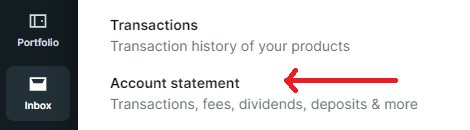

# Export to Ghostfolio

[](https://github.com/sponsors/dickwolff) &nbsp;
[](https://www.buymeacoffee.com/dickw0lff) 


This tool allows you to convert a multiple transaction exports (CSV) to an import file that can be read by [Ghostfolio](https://github.com/ghostfolio/ghostfolio/). Currently there is support for:

- [DEGIRO](https://degiro.com)
- [eToro](https://www.etoro.com/)
- [Finpension](https://finpension.ch)
- [Freetrade](https://freetrade.io)
- [Interactive Brokers (IBKR)](https://www.interactivebrokers.com)
- [Rabobank](https://rabobank.nl)
- [Schwab](https://www.schwab.com)
- [Swissquote](https://en.swissquote.com/)
- [Trading 212](https://trading212.com)
- [XTB](https://www.xtb.com/int)

Is your broker not in the list? Feel free to create an [issue](https://github.com/dickwolff/Export-To-Ghostfolio/issues/new) or, even better, build it yourself and create a [pull request](https://github.com/dickwolff/Export-To-Ghostfolio/compare)!

## Download transaction export

See the transaction export instructions for each of the supported brokers below. 

<details>
<summary>View transaction export instructions</summary>

### DEGIRO

Login to your DEGIRO account and create an export file (via Inbox > Account Overview, see image below). Choose the period from which you wish to export your history and click download.



### eToro

Login to your eToro account and navigate to "Portfolio". Then select "History" in the top menu. Next, click on the icon on the far right and select "Account statement". Choose the dates of interest and click "Create". On the next page, click on the Excel icon on the top right to download the file. After downloading, open the file in Excel and delete all the tabs except the "Account Activity" tab. Then use Excel to convert the file to CSV.

### Finpension

Login to your Finpension account. Select your portfolio from the landing page. Then to the right of the screen select “Transactions”, on the following page to the right notice “transaction report (CSV-file)” and click to email or click to download locally.

### Freetrade

Open the Freetrade app. Select your portfolio from the option in the top-left under the "Portfolio" heading. Select "Activity" from the list of icons along the bottom of the screen. Select the share icon in the top-right corner and then follow the on-screen instructions.

### Interactive Brokers (IBKR)

Login to your Interactive Brokers account. Navigate to Account Management and click "Reporting" in the sidebar. Next, click on the "Flex Queries"-tab in the "Reporting" section. From the Flex "Queries section", Click the plus (+) icon on the right side to create a new Flex Query. Create a new Flex Query for Trades, and another one for Dividends. Set the export format to "CSV". See the required columns below the image.


####  Trades

For trades, select "Trades". Then select the following properties: `Buy/Sell, TradeDate, ISIN, Quantity, TradePrice, TradeMoney, CurrencyPrimary, IBCommission, IBCommissionCurrency`.

#### Dividends

For dividends, select "Cash Transactions". Then select the following properties: `Type, SettleDate, ISIN, Description, Amount, CurrencyPrimary`.

### Rabobank

Login to Rabobank and navigate to your investments. Navigate to "Transactions & Contract Notes" (Mutaties & Nota's). Select the range you wish to export at the top. Then scroll to the bottom of the page and click "Export as .csv"

### Schwab

Login to your Schwab account. Go to “Accounts” then “History”. Select the account you want to download details from. Select the “Date Range” and select “Export” (csv). Save the file.


### Swissquote

Login to your Swissquote account. From the bar menu click on “Transactions”. Select the desired time period as well as types and then select the “export CSV” button to the right.

### Trading 212

Login to your Trading 212 account and create an export file (via History > Download icon). Choose the period from which you wish to export your history and click download.

### XTB

Login to your XTB account and from the top bar click on "Account history", then "Cash operations". Click the "Export button". Choose the period from which you wish to export your history, select report type "Cash Operations" choose file format "csv" then click "Export Report" button.

</details>

## How to use

You can run the tool on your local machine by cloning this repository. You can also run the tool inside a Docker container. See the runtime specific instructions below.

## Docker

[](https://hub.docker.com/r/dickwolff/export-to-ghostfolio)

<details>
<summary>View instructions</summary>

### System requirements

To run the Docker container you need to have [Docker](https://docs.docker.com/get-docker/) installed on your machine. The image is published to [Docker Hub](https://hub.docker.com/r/dickwolff/export-to-ghostfolio). 

### How to use

Contrary to the locally run version of the tool, the containerized version tries to determine which file type to process by looking to the header line inside the file. So there is no need to specify which converter to use.

 You can then run the image like:

```
docker run -d -v /C/.../docker_in:/var/e2g-input -v /C/.../docker_out:/var/e2g-output --env GHOSTFOLIO_ACCOUNT_ID=xxxxxxx dickwolff/export-to-ghostfolio
```

The following parameters can be given to the Docker run command.

| Command | Optional | Description |
| ------- | -------- | ----------- |
| ` -v {local_in-folder}:/var/e2g-input` | N | The input folder where you put the files to be processed |
| `-v {local_out_folder}:/var/e2g-output` | N | The output folder where the Ghostfolio import JSON will be placed. Also the input file will be moved here when an error ocurred while processing the file. |
| `-v {local_cache_folder}:/var/e2g-cache` | Y | The folder where Yahoo Finance symbols will be cached  |
| `--env GHOSTFOLIO_ACCOUNT_ID=xxxxxxx` | N | Your Ghostolio account ID <sup>1</sup> |
| `--env USE_POLLING=true` | Y | When set to true, the container will continously look for new files to process and the container will not stop. |
| `--env DEBUG_LOGGING=true` | Y | When set to true, the container will show logs in more detail, useful for error tracing. |
| `--env FORCE_DEGIRO_V2=true` | Y | When set to true, the converter will use the DEGIRO V2 converter (currently in beta) when a DEGIRO file was found. |
| `--env PURGE_CACHE=true` | Y | When set to true, the file cache will be purged on start. |

1: You can retrieve your Ghostfolio account ID by going to Accounts > select your account and copying the ID from the URL.


### Caching

The tool uses `cacache` to store data retrieved from Yahoo Finance inside the container. This way the load on Yahoo Finance is reduced and the tool should run faster. The cached data is stored inside the container in `tmp/e2g-cache`. If you feel you need to invalidate your cache, you can do so by adding `--env PURGE_CACHE=true` to your run command. This will clear the cache on container start, and the tool will recreate the cache the next time it has to retrieve data from Yahoo Finance.

</details>

## Run locally

<details>
<summary>View instructions</summary>

### System requirements

The tool requires you to install the latest LTS version of Node, which you can download [here](https://nodejs.org/en/download/). The tool can run on any OS on which you can install Node.

### Use the tool

Next, clone the repo to your local machine and open with your editor of choice (e.g. Visual Studio Code).

Run `npm install` to install all required packages.

The repository contains a sample `.env` file. Rename this from `.env.sample`.

- Put your export file path in the `INPUT_FILE` variable. This has to be relative to the root of the project.
- Put the Ghostfolio account name where you want your transactions to end up at in `GHOSTFOLIO_ACCOUNT_ID` 
  - This can be retrieved by going to Accounts > select your account and copying the ID from the URL 
  
    
- Optionally you can enable debug logging by setting the `DEBUG_LOGGING` variable to `TRUE`.

You can now run `npm run start [exporttype]`. See the table with run commands below. The tool will open your export and will convert this. It retrieves the symbols that are supported with YAHOO Finance (e.g. for European stocks like `ASML`, it will retrieve `ASML.AS` by the corresponding ISIN).

| Exporter    | Run command                         |
| ----------- | ----------------------------------- |
| DEGIRO      | `run start degiro`                  |
| Finpension  | `run start finpension` (or `fp`)    |
| Freetrade   | `run start freetrade`  (or `ft`)    |
| Swissquote  | `run start swissquote` (or `sq`)    |
| Schwab      | `run start schwab`                  |

### Caching

The tool uses `cacache` to store data retrieved from Yahoo Finance on disk. This way the load on Yahoo Finance is reduced and the tool should run faster. The cached data is stored in `tmp/e2g-cache`. If you feel you need to invalidate your cache, you can do so by removing the folder and the tool will recreate the cache when you run it the next time.

</details>

## Import to Ghostfolio

The export file can now be imported in Ghostfolio by going to Portfolio > Activities and pressing the 3 dots at the top right of the table. Since Ghostfolio 1.221.0, you can now preview the import and validate the data has been converted correctly. When it is to your satisfaction, press import to add the activities to your portfolio.

